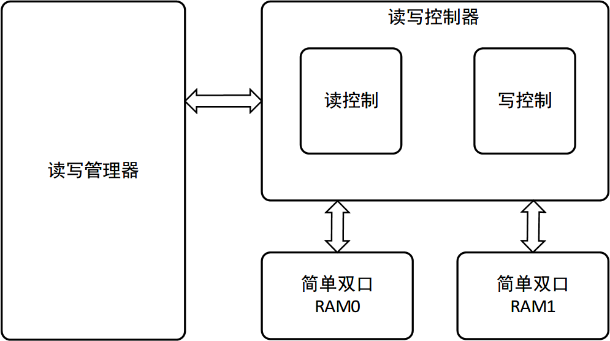
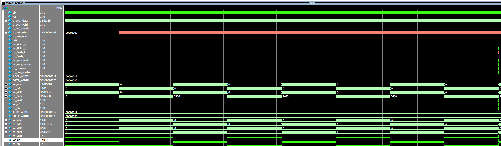

# 矩阵转置的FPGA实现

```txt
matrix_trans_top.sv	：顶层模块
	-- wrd_manage.sv：管理读写操作的存储块
	-- wrd_ctrl.sv	：产生存储器的读写时序
		-- wr_ctrl.sv：写控制
		-- rd_ctrl.sv：读控制
	-- ultraRAM.sv	：使用Xlinx原语封装ultraRAM

ram_interface.sv：接口定义文件
		
```

实现框图：



Modelsim仿真图：



